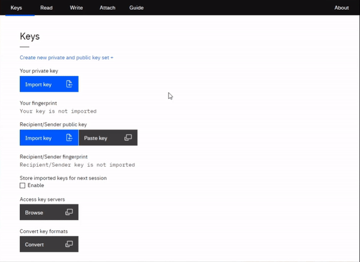

# MagicPad v0.0.3

MagicPad is an OpenPGP encryption / decryption tool for beginners. It is designed to be run standalone via the browser or as an executable (Electron).
Using PGP as the main encryption engine, the encryption key generated in MagicPad are powerful 4096-bit keys.



## Installation

You can run MagicPad four ways:
1. Download executable at `https://www.magicpad.io`
2. Clone and run `./app/index.html` via web browser
3. Clone, build and run executable (saved at `./dist`):
```
npm install
npm run dist
```
To only build html/css/js without running electron, run: `npm run buildwebapp`
If building from Ubuntu, run this first:
```
sudo apt-get install rpm
```
4. Run Electron via Node from command line (you need Electron globally installed):
```
npm i -g magicpad
npm i -g electron
magicpad
```

## Build explained

In the build procedure, the following happens:
1. HTML files in the `./html_src` folder are combined into a single `index.html` file in `./app`.
2. JS files in `./app/js` are added as `<script>` tags after `</body>` tag in `index.html`. (Step 1 and 2 are controlled by `./build_magicpad.index.js`)
3. `index.html` is saved to `./app`.
4. All other files are static in `./app` and are not altered.
5. Electron executable is created in a `./dist` folder.

## PWA Config

If you want to host your own MagicPad PWA, you must edit the `"start_url"` property `manifest.json` file in `/src`

## Packages

Software used:
1. Node.js
2. url, path, fs-extra, ncp, and jsdom packages
3. Electron, Electron Context Menu, and Electron builder
4. Openpgp.js
5. Steganography.js
6. jQuery
7. Font and design styling by IBM

## Contributing

Pull requests are welcome. For major changes, please open an issue first to discuss what you would like to change.

Please make sure to update tests as appropriate.

## License
[MIT](https://choosealicense.com/licenses/mit/)
